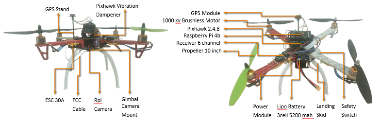
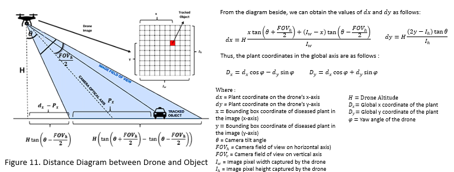

# 🚁 DroneTA – Automatic Leaf Disease Detection using Drone & Node-RED

This project integrates **drone autonomous path mapping**, **image-based disease detection (YOLOv8)**, and a **Node-RED dashboard** for real-time monitoring of cassava leaf diseases.  
It consists of multiple environments for local simulation, drone execution, and dashboard visualization.  

---
## 🛠️ Hardware Setup
The drone consists of the following components:

- Pixhawk 2.4.8 flight controller with GPS module  
- Raspberry Pi 4B for onboard processing  
- RPi Camera for disease detection  
- 1000 kV Brushless Motors with 10-inch propellers  
- ESC 30A and power distribution  
- LiPo Battery (3S 5200 mAh)  
- 6-channel receiver and safety switch  
- Gimbal camera mount and landing skid  



## 📡 System Overview
The drone detects diseased plants, calculates their position, and logs them in the global coordinate system.

  

## 📂 Repository Structure

### 1. **LocalEnv/**
Code to be run on the **local machine (laptop/PC)** for drone path mapping and SITL (Mission Planner) simulation.

- **KeyPressModule.py** → Converts keyboard input into Pygame window input (e.g., pressing "left" sends a left movement to Pygame).  
- **Mapping.py** → Mapping program for drone path using keyboard input and displaying it in Pygame. The result is saved in `vals_data.txt`.  
- **vals_data.txt** → Contains drone movement commands (forward/backward, left/right, yaw, initial location).  
- **best(2).pt** → Trained YOLOv8 model for detecting cassava leaf diseases.  
- **Terrain.jpg** → Image of the farming area, used as a mapping reference in Pygame.  

---

### 2. **DroneEnv/**
Code to be run on the **Raspberry Pi (companion computer)** onboard the drone.  
Responsible for executing flight commands, capturing plant images, running YOLO inference, and geolocation processing.

- **DroneControl.py** → Main code for automatic leaf disease detection. Executes path commands from `vals_data.txt`, captures images, processes them with YOLOv8, generates geolocation plots, and pushes results to GitHub.  
- **best(2).pt** → YOLOv8 model used on the drone.  
- **Terrain_capture.py** → Captures `Terrain.jpg` by flying the drone to a set altitude and taking an overview photo of the farm.  
- **vals_data.txt** → Drone path commands (copied from LocalEnv).  

---

### 3. **Images/**
Contains **plots and detection results** uploaded by the drone and later displayed on the Node-RED dashboard:

- `Drone Path Map.jpg` → Map of the drone’s flown path.  
- `merged_output.jpg` → Combined disease detection result with bounding boxes over the farm area.  
- `scatter_Chlorosis.png`, `scatter_Gulma.png`, `scatter_Leaf Spot.png`, `scatter_Necrosis.png`, `scatter_Pest.png` → Scatter plots of detected diseases.  
- `scatter_all.png` → Combined scatter plot of all detected diseases.  

---

### 4. **Node-RED/**
Contains the Node-RED flow for the **dashboard visualization**.

- **flows_DroneTA.json** → Node-RED flow export file to be imported into Node-RED to set up the dashboard.  

---

## ▶️ Usage Instructions

### 1. Local Environment (Simulation & Mapping)

1. Install dependencies (on local machine):
   ```bash
   pip install ultralytics pygame opencv-python matplotlib
